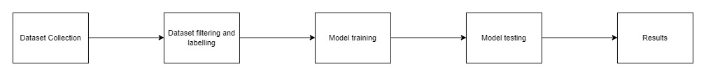
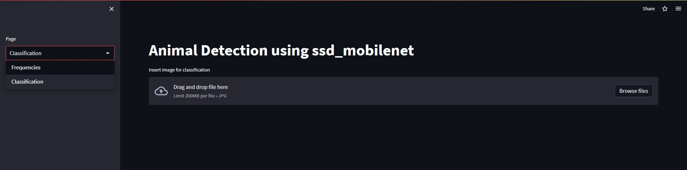
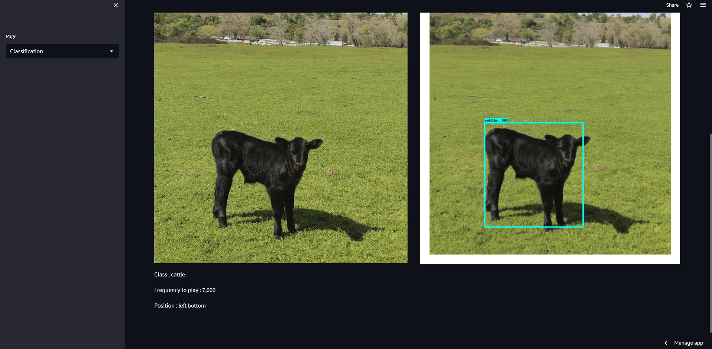
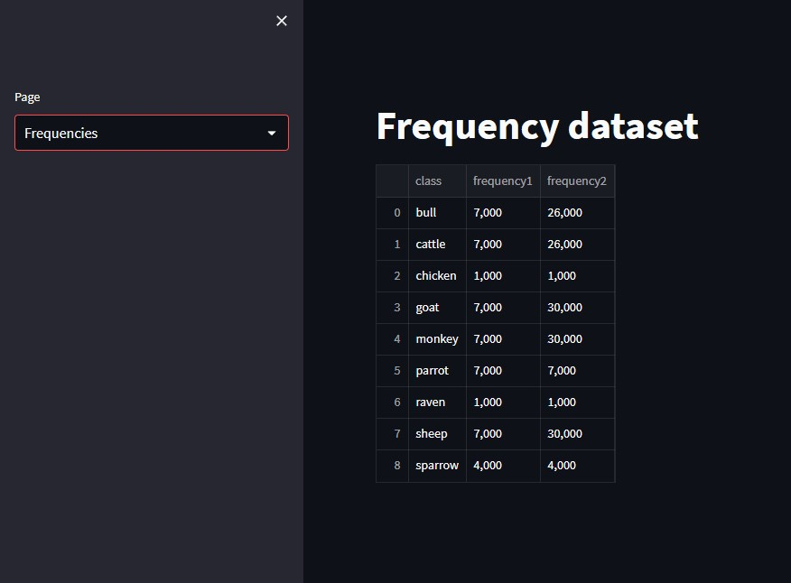

# Title: Animal Detection with custom dataset

## 1. Methodology

## 2. Description
Image dataset link : https://www.kaggle.com/datasets/antoreepjana/animals-detection-images-dataset
Labelling images using labelimg python package
Frequency dataset reference : https://en.wikipedia.org/wiki/Hearing_range

## 3. Input/Output
User can upload images which will then be classified based upon the pretrained model, 
then the frequency for the detected animal is displayed via the frequency dataset

## 4. Live Link
https://shiroyasha30-animal-detection-tmp-1pgatt.streamlit.app/

## 5. Screenshots of the Interface

